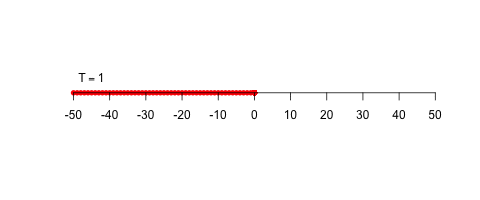

# TASEP

TASEP (totally asymmetric simple exclusion process) is a stochastic particle system on the one-dimensional lattice.

Let $\mathbb{Z}$ denote the set of integers and $\mathcal{C}(\mathbb{Z}):=\{0, 1\}^{\mathbb{Z}}$, which is referred as the space of configurations. More precisely, every $\omega=(\omega_x)_{x\in\mathbb{Z}}\in\mathcal{C}(\mathbb{Z})$ can be regarded the configuration of particles on $\mathbb{Z}$ as follows:
$$
\omega_x=\begin{cases}1&\text{if }x\text{ is occupied by a particle},\\0&\text{if }x\text{ is empty}.\end{cases}
$$
In this model, particles behave fermionic, that is, each side is occupied by only one particle. Mathematically, TASEP is a continuous/discrete time Markov process on $\mathcal{C}(\mathbb{Z})$. Physically, such process represents an interacting stochastic particle system on $\mathbb{Z}$.

In haskell, we can freely make data types, and this is useful for mathematical programming. For instance, to represent particle system on $\mathbb{Z}$, we prepare the following two data types `MyState` and `Config` that are assigned with the state space and the configuration space, respectively. Here, `MyState` is just `Int` type, but `Config` is lists of `MyState`. Notably, there is no restriction on the length of arguments of type `Config`.

```haskell
-- define data types
type MyState = Int
type Config = [MyState]
```

In TASEP, each particle tries to hop to the right by only one site. However, this can not hop if its right site is occupied by another particle. TASEP is classified into several types depending on whether the time evolution is continuous or discrete, the rules of random particle hopping, and the order of particle hopping updates.

Here we will discrete time evolution. 

## Bernoulli distribution
First of all, we create a `Bernoulli distribution generator`. To deal with random variables, we must import `System.Random`:
```haskell
import System.Random
```
If this package is not installed, you must run the following command in the terminal:
```
stack install random
```

The following creates the Bernoulli distributed random variable with given `rate`.
```haskell
-- bernoulli distribution generator
ber_gen:: Double -> IO Int
ber_gen rate = do
    rv::Double <- randomRIO (0, 1)
    return $ if rate >= rv then 1 else 0
```

## Initial conditions
We consider the step initial condition:
```haskell
-- step initial condition 
step_initialization:: Int -> Config
step_initialization n = replicate (n+1) 1 ++ replicate n 0
```

## Code for simulation
Finally, our code is written as follows:
```haskell
-- environment
import System.Random

-- define data types
type MyState = Int
type Config = [MyState]

-- step initial condition 
step_initialization:: Int -> Config
step_initialization n = replicate (n+1) 1 ++ replicate n 0

-- bernoulli distribution generator
ber_gen:: Double -> IO Int
ber_gen rate = do
    rv::Double <- randomRIO (0, 1)
    return $ if rate >= rv then 1 else 0

-- create a hopping ... hopping occurs only if [a, b]==[1, 0] and flag ==1
hopping1:: MyState -> MyState -> Double -> IO Config
hopping1 a b rate = do 
    flag::Int <- ber_gen rate
    return $ if (flag*a*(1-b)) == 1 then [0, 1] else [a, b]

-- update by discrete time bernoulli tasep with sequential update
-- the last of result is dummy !!
disc_ber_tasep_seq_update:: Config -> Config -> Double -> IO Config
disc_ber_tasep_seq_update [] now_tail _ = return (1: tail now_tail)
disc_ber_tasep_seq_update now_top now_tail rate = do
    exchange::Config <- hopping1 (last now_top) (head now_tail) rate
    result::Config <- disc_ber_tasep_seq_update (init now_top) (exchange ++ (tail now_tail)) rate 
    return result

-- my print (to analyze later)
my_print:: Config -> IO ()
my_print [] = do
    putStrLn "\n" 
my_print config = do
    putStr (show (head config))
    putStr ", "
    my_print (tail config)

-- trial
trial_tasep:: Config -> Int -> Double -> IO ()
trial_tasep config 1 _ = my_print config
-- trial_tasep config 1 _ = print config
trial_tasep config n rate = do
    my_print config
    -- print config
    next_config::Config <- disc_ber_tasep_seq_update config [0] rate
    trial_tasep (init next_config) (n-1) rate

-- main
main :: IO ()
main = do
    let config = step_initialization 50
    trial_tasep config 500 0.2
```

## Analysis of the results
The following is an animation of the result with hopping rate 0.2.



To illustrate this animation, we used `R`. The following is the code to analyze the result:
```r
library(animation)

dat <- read.table("sample.dat", sep=',')
temp <- as.integer(dat[1,])
l<- length(temp)-1
temp <- head(temp, l)
s <- sum(temp)-1
x <- rep(0, l)

re_plot <-function(n){
    for(i in 1:n){
        y <- head(as.integer(dat[i,]), l)
        plot(y*c(-s:s), x, pch=16, col="RED", xlab="", ylab="", xlim=c(-s, s), bty="n", xaxt="n", yaxt="n")
        text(-s+5, 0.5, bquote(T==.(i)))
        axis(side=1, pos=0, at=seq(-s, s, by=10))
    }}
    # re_plot(nrow(dat))
    saveGIF(re_plot(nrow(dat)), movie.name="sample.gif", interval=0.1, ani.height=200)
```